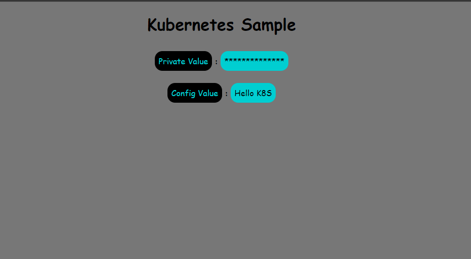

# Kubernetes Sample

Esse é um exemplo de projeto utilizando Kubernetes

## Requisitos
- Um ambiente linux, seja uma distro linux, uma máquina virtual ou um subsistema linux.
- Instalação do docker
- Instalação do minikube
- Instalação da ferramente kubectl

## Para preparar o ambiente:

Para preparar o ambiente execute o script
``./setup.sh``, isso irá configurar o minikube no docker e construir a imagem do projeto nele, caso já tenha o minikube configurado no docker, para evitar problemas, o ideal é remover o contêiner e subir novamente com o script fornecido.

## Executar o cluster

Para executar o cluster basta executar o comando ``kubectl apply -f k8s.yaml``. O projeto será acessado via **http://localhost:30082**
